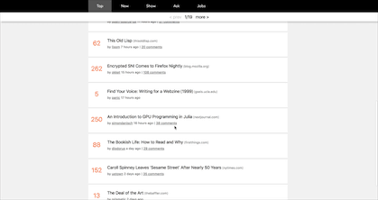

#### 3.4 Router: transition
本节主要实现页面之间切换的过渡效果，主要用到的是[过渡 & 动画](https://cn.vuejs.org/v2/guide/transitions.html，以及一些CSS的知识。

需要注意⚠️的是：

> 当有**相同标签名**的元素切换时，需要通过 `key` 特性设置唯一的值来标记以让 Vue 区分它们，否则 Vue 为了效率只会替换相同标签内部的内容。即使在技术上没有必要，**给在 <transition> 组件中的多个元素设置 key 是一个更好的实践。**

我们所做的正是**相同标签名**的元素切换，所以需要设置`key`属性，我们使用**页码**作为key属性。

整个过渡过程可以用下面的图来概括：


> 在进入/离开的过渡中，会有 6 个 class 切换。
>
> 1. `v-enter`：定义进入过渡的开始状态。在元素被插入之前生效，在元素被插入之后的下一帧移除。
> 2. `v-enter-active`：定义进入过渡生效时的状态。在整个进入过渡的阶段中应用，在元素被插入之前生效，在过渡/动画完成之后移除。这个类可以被用来定义进入过渡的过程时间，延迟和曲线函数。
> 3. `v-enter-to`: **2.1.8版及以上** 定义进入过渡的结束状态。在元素被插入之后下一帧生效 (与此同时 `v-enter` 被移除)，在过渡/动画完成之后移除。
> 4. `v-leave`: 定义离开过渡的开始状态。在离开过渡被触发时立刻生效，下一帧被移除。
> 5. `v-leave-active`：定义离开过渡生效时的状态。在整个离开过渡的阶段中应用，在离开过渡被触发时立刻生效，在过渡/动画完成之后移除。这个类可以被用来定义离开过渡的过程时间，延迟和曲线函数。
> 6. `v-leave-to`: **2.1.8版及以上** 定义离开过渡的结束状态。在离开过渡被触发之后下一帧生效 (与此同时 `v-leave` 被删除)，在过渡/动画完成之后移除

在vue部分并不需要多少代码，主要难点是CSS，实际的效果和我们预想的效果差距很大。

``` vue
<transition :name="transition">
    <div :key="displayPage" v-if="true" class="overflow-hidden pt4 mt3 absolute">
        <transition-group tag="div" name="item">
            <story-card
                        v-for="story in displayList"
                        v-if="!!story"
                        :key="story.id"
                        :story="story"
                       	></story-card>
        </transition-group>
    </div>
</transition>
```

在前往上一页和下一页时，需要有不同的效果，所以，`name`有两个值,slide-left和slide-right；item的过渡效果现在还没有用到，对于列表的过渡需要使用`transition-group`。

``` css
.slide-left-enter, .slide-right-leave-to {
    opacity: 0;
    transform: translate(30px, 0);
}
.slide-left-leave-to, .slide-right-enter {
    opacity: 0;
    transform: translate(-30px, 0);
}
.slide-left-enter-active, .slide-left-leave-active, .slide-right-enter-active, .slide-right-leave-active {
    transition: all .5s cubic-bezier(.55, 0, .1, 1);
}

.item-move, .item-enter-active, .item-leave-active {
    transition: all .5s cubic-bezier(.55, 0, .1, 1)
}
.item-enter {
    opacity: 0;
}
.item-leave-active {
    position: absolute;
    opacity: 0;
    transform: translate(30px, 0);
}
```

#### ⚠️：

1. `fixed`的定位依靠top,left,bottom,right
2. 在编写动画过渡效果时，要特别注意元素的定位方式。


