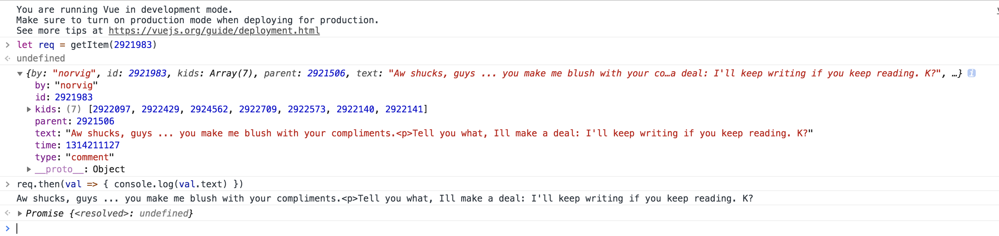

# Vue HackNews

## 从零开始
从零开始，一步一步来构建Vue HackNews。

### 0. Hello World

新建`index.html`和`main.js`，并通过cdn引入`Vue.js`。可以参考[Template](https://jsfiddle.net/chrisvfritz/50wL7mdz/) 。


看到类似的界面，第一步就成功了！

### 1. Get Data

#### 1.1 Firebase API

首先阅读Firebase的API是如何构成的，然后尝试将数据展示到我们的界面上。

通过[Documentation and Samples for the Official HN API](https://github.com/HackerNews/API)来了解`Hacker News`的API的具体内容。

阅读[Firebase: App success made simple](https://firebase.google.cn/docs/web/setup)的内容，通过CDN的形式引入`Firebase`，配置选项中，我们只需要保留`databaseURL`一个属性。

``` javascript
let config = {
    databaseURL: "https://hacker-news.firebaseio.com",
}
firebase.initializeApp(config)
```

这样就成功的引入了`Firebase`，由于我们需要的是他的数据库服务，所以下一步是熟悉`database`服务的使用方法。阅读[datebase](https://firebase.google.cn/docs/database/web/start)来了解如何在网页上使用`Firebase`的数据库服务。

> 注意`Firebase`CDN的两种引入方式：当引入`firebase`则不需要再引入其他单独的组件；当引入`firebase-app`时，仍需要引入`firebase-database`组件。

我们首先尝试获取`items`，使用`/v0/item/<id>`API。

``` javascript
function getItem(itemId) {
    return database.ref('/v0' + '/item/' + itemId)
        .once('value')
        .then(snapshot => {
        const val = snapshot.val()
        console.log(val)
        resolve(val)
    })
}
```

我们可以在控制台测试我们的代码是否正确：



`database`每次请求返回的是一个`Promise`，可以看到我们的数据和官方给出的数据相同，当然你也可以尝试其他的ID。

#### 1.2 Other API

我们现在只有一个获取`item`的函数，接下来编写获取其他数据的函数(暂时不考虑监控数据的变化)。

|               功能                |               URL               |
| :-------------------------------: | :-----------------------------: |
|               Users               |          /v0/user/<id>          |
|            Max Item ID            |           /v0/maxitem           |
| topstories,newstories,beststories | /v0/{top \| new \| best}stories |
| askstories,showstories,jobstories | /v0/{ask \| show \| job}stories |
|    Changed Items and Profiles     |           /v0/updates           |

由于要修改的东西比较多，所以我们把获取数据库数据的部分移动到一个单独的文件中。

由于我们要访问多个URL，且都是以`v0`开头，所以这里采用定义`rootRef`的形式，具体介绍见[Firebase database Reference API](https://firebase.google.cn/docs/reference/js/firebase.database.Reference)，之后的参数可以使用`child`来指定。

``` javascript
function getUser(userId) {
    return rootRef.child('user/' + userId)
    .once('value')
    .then(snapshot => {
        const val = snapshot.val()
        return val
    })
}

function getMaxItemId() {
    return rootRef.child('maxitem')
    .once('value')
    .then(snapshot => {
        const val = snapshot.val()
        return val
    })
}

function getStories(type) {
    if (['top', 'new', 'best', 'ask', 'show', 'job'].indexOf(type) === -1) return
    return rootRef.child(`${type}stories`)
    .once('value')
    .then(snapshot => {
        const val = snapshot.val()
        return val
    })
}

function getUpdates() {
    return rootRef.child(`updates`)
    .once('value')
    .then(snapshot => {
        const val = snapshot.val()
        return val
    })
}
```

将其他接口编写完成并进行测试，这只是一个初步的版本，再之后还会进行修改。

------

调用Firebase API来获取数据的部分差不多已经结束了，我们的第一个目标是编写一个静态渲染的界面，所以监测数据变化的工作会在之后的阶段进行。