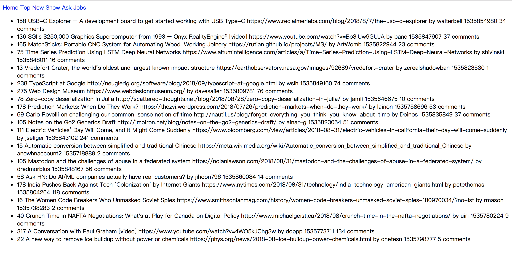
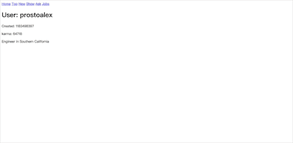

# Vue HackNews

## 从零开始
从零开始，一步一步来构建Vue HackNews。

### 0. Hello World

新建`index.html`和`main.js`，并通过cdn引入`Vue.js`。可以参考[Template](https://jsfiddle.net/chrisvfritz/50wL7mdz/) 。


看到类似的界面，第一步就成功了！

### 1. Get Data

#### 1.1 Firebase API

首先阅读Firebase的API是如何构成的，然后尝试将数据展示到我们的界面上。

通过[Documentation and Samples for the Official HN API](https://github.com/HackerNews/API)来了解`Hacker News`的API的具体内容。

阅读[Firebase: App success made simple](https://firebase.google.cn/docs/web/setup)的内容，通过CDN的形式引入`Firebase`，配置选项中，我们只需要保留`databaseURL`一个属性。

``` javascript
let config = {
    databaseURL: "https://hacker-news.firebaseio.com",
}
firebase.initializeApp(config)
```

这样就成功的引入了`Firebase`，由于我们需要的是他的数据库服务，所以下一步是熟悉`database`服务的使用方法。阅读[datebase](https://firebase.google.cn/docs/database/web/start)来了解如何在网页上使用`Firebase`的数据库服务。

> 注意`Firebase`CDN的两种引入方式：当引入`firebase`则不需要再引入其他单独的组件；当引入`firebase-app`时，仍需要引入`firebase-database`组件。

我们首先尝试获取`items`，使用`/v0/item/<id>`API。

``` javascript
function getItem(itemId) {
    return database.ref('/v0' + '/item/' + itemId)
        .once('value')
        .then(snapshot => {
        const val = snapshot.val()
        console.log(val)
        resolve(val)
    })
}
```

我们可以在控制台测试我们的代码是否正确：


`database`每次请求返回的是一个`Promise`，可以看到我们的数据和官方给出的数据相同，当然你也可以尝试其他的ID。

#### 1.2 Other API

我们现在只有一个获取`item`的函数，接下来编写获取其他数据的函数(暂时不考虑监控数据的变化)。

|               功能                |               URL               |
| :-------------------------------: | :-----------------------------: |
|               Users               |          /v0/user/<id>          |
|            Max Item ID            |           /v0/maxitem           |
| topstories,newstories,beststories | /v0/{top \| new \| best}stories |
| askstories,showstories,jobstories | /v0/{ask \| show \| job}stories |
|    Changed Items and Profiles     |           /v0/updates           |

由于要修改的东西比较多，所以我们把获取数据库数据的部分移动到一个单独的文件中。

由于我们要访问多个URL，且都是以`v0`开头，所以这里采用定义`rootRef`的形式，具体介绍见[Firebase database Reference API](https://firebase.google.cn/docs/reference/js/firebase.database.Reference)，之后的参数可以使用`child`来指定。

``` javascript
function getUser(userId) {
    return rootRef.child('user/' + userId)
    .once('value')
    .then(snapshot => {
        const val = snapshot.val()
        return val
    })
}

function getMaxItemId() {
    return rootRef.child('maxitem')
    .once('value')
    .then(snapshot => {
        const val = snapshot.val()
        return val
    })
}

function getStories(type) {
    if (['top', 'new', 'best', 'ask', 'show', 'job'].indexOf(type) === -1) return
    return rootRef.child(`${type}stories`)
    .once('value')
    .then(snapshot => {
        const val = snapshot.val()
        return val
    })
}

function getUpdates() {
    return rootRef.child(`updates`)
    .once('value')
    .then(snapshot => {
        const val = snapshot.val()
        return val
    })
}
```

将其他接口编写完成并进行测试，这只是一个初步的版本，再之后还会进行修改。

------

调用Firebase API来获取数据的部分差不多已经结束了，我们的第一个目标是编写一个静态渲染的界面，所以监测数据变化的工作会在之后的阶段进行。

### 2. Render Page

初步目标是实现所有页面(除`comments`界面)的数据展示和整个页面的布局设计，没有引入路由和组件，所以会有很多的`v-if`来区分各个状态。我们将会一步一步的来实践`Vue`的各个概念。

因为comments界面涉及递归渲染数据，是一个树形视图，需要涉及到递归渲染组件的操作，在把页面划分为组件时再编写这部分的代码。

#### 2.1 Render Page: HTML and Data

在这一节，将忽略样式(CSS)，将每一部分的功能划分清楚，这样将会对之后的其他工作有很大的帮助。

这个界面的编写其实非常简单，难点在于我们如何利用前面写好的`api`。

如果熟悉`Vue`的生命周期，那么我们可以在`created`时来获取我们想要的数据，需要注意的就是如何在获取到`Id List`之后再去获取每个ID对应的数据。

```javascript
let app = new Vue({
    el: "#app",
    data: {
        topNewsList: [],
        topNewsData: []
    },
    created() {
        getStories('top')
        .then(val => {
            this.topNewsList = val.slice(0, 20)
            this.getStoriesItem(this.topNewsList)
            .then(data => this.topNewsData = data)
        })
    },
    methods: {
        getStoriesItem(stories) {
            return Promise.all(stories.map(id => getItem(id)))
        }
    }
})
```

``` html
<div id="app">
    <header>
        <nav>
            <a href="/">Home</a>
            <a href="/top">Top</a>
            <a href="/new">New</a>
            <a href="/show">Show</a>
            <a href="/ask">Ask</a>
            <a href="/jobs">Jobs</a>
        </nav>
    </header>
    <main>
        <ul>
            <li v-for="news in topNewsData">
                <span> {{news.score}} </span>
                <span> {{news.title}} </span>
                <span> {{news.url}} </span>
                <span> by {{news.by}} </span>
                <span> {{news.time}} </span>
                <span> {{news.descendants}} comments</span>
            </li>
        </ul>
    </main>
</div>
```

现在的效果如下：



接下来我们将编写剩下的界面。

#### 2.2 Render Page: event and v-if

由于我们要获取的数据更多，所以我们会稍微修改一下获取数据的函数，在开始时获取全部的数据，并保存到一个对象中。由于`Vue`的[响应式原理](https://cn.vuejs.org/v2/guide/reactivity.html)，所以我们直接给对象添加属性，`Vue`并不能直接监测数据的改变(Vue **不能检测到对象属性的添加或删除**，如果新建一个对象则是可以检测到这个变化并重新渲染的)，需要使用`Vue.set() or this.$set()`来为一个对象添加一个新的属性。

``` javascript
created() {
    ['top', 'new', 'show', 'ask', 'job'].forEach(state => {
        getStories(state)
            .then(val => {
            let itemList = val.slice(0, 20)
            this.getStoriesItem(itemList)
                .then(data => this.$set(this.apiData, state, data))
        })
    })
}
```

为了保存不同的现在的状态，我们在`data`中增加`state`属性，在点击导航栏时更改当前的状态。

需要注意的是，现在还没有路由，更换URL不会访问到任何东西，所以在这里我们将阻止`<a>`标签的默认行为并绑定点击事件。

``` html
<div id="app">
    <header>
        <nav>
            <a href="/" @click.prevent="handleNavClick($event,'top')">Home</a>
            <a href="/top" @click.prevent="handleNavClick($event,'top')">Top</a>
            <a href="/new" @click.prevent="handleNavClick($event,'new')">New</a>
            <a href="/show" @click.prevent="handleNavClick($event,'show')">Show</a>
            <a href="/ask" @click.prevent="handleNavClick($event,'ask')">Ask</a>
            <a href="/jobs" @click.prevent="handleNavClick($event,'job')">Jobs</a>
        </nav>
    </header>
    <main>
        <ul>
            <li v-for="news in apiData[state]">
                <span> {{news.score}} </span>
                <span> {{news.title}} </span>
                <span> {{news.url}} </span>
                <span> by {{news.by}} </span>
                <span> {{news.time}} </span>
                <span> {{news.descendants}} comments</span>
            </li>
        </ul>
    </main>
</div>
```

这样就简单的实现了不同tab的切换。

接下来还有两个界面，`User`和`Comment`(划掉)。

在编写时发现`state`这个变量名含义不是很明确，更改为`storyState`来表示`['top', 'new', 'show', 'ask', 'job']`这5个状态，`state`来表示`['story', 'user', 'comments']`三个状态。

``` html
<ul v-if="state === 'story'">
    <li v-for="news in apiData[storyState]">
        ...
        <span @click="handleUserClick(news.by)" style="color: red;"> by {{news.by}} </span>
        ...
    </li>
</ul>

<div v-if="state === 'user'">
    <h1>User: {{currentUserData.id}} </h1>
    <p>Created: {{currentUserData.created}} </p>
    <p>karma: {{currentUserData.karma}} </p>
    <div v-html="currentUserData.about"></div>
</div>
```

``` javascript
getUserData(userId) {
    return getUser(userId)
        .then(val => {
        this.currentUserData = val
    })
},
handleUserClick(userId) {
    this.getUserData(userId)
        .then(
        this.state = 'user'
    )
}
```

现在的状态：



我们发现在快速切换`User`的时候，会保存有上一次的状态，所以我们需要在获取数据之前先把现在的数据清空，这样就不会发生加载用户数据的过程中显示另一个用户数据的让人困惑的结果。

``` javascript
handleUserClick(userId) {
    this.currentUserData = {}
    this.getUserData(userId)
        .then(
        this.state = 'user'
    )
}
```

#### 2.3 Render Page: CSS

你可以选择从头开始写或者选择任何一种你所熟悉的CSS工具库，在这里我选择的是`tachyons`，一种新的`Functionial CSS`概念。

>[Tachyons](http://tachyons.io/)
>
>[Learn Tachyons](https://github.com/dwyl/learn-tachyons)
>
>[Search Tachyons Class](https://tachyons-tldr.now.sh/)

发现`Home`没有什么用，选择删掉。

重写了`story`和`User`的样式，并针对不同`story`的数据进行了不同的判断。

> 注意⚠️：
>
> item中存在url为空的情况，这种情况是链接到hacknews内部的一篇文章，需要特殊处理。
>
> 还有可能存在item为null的情况，需要在渲染的时候判断一下。

hacknews内部的文章的界面还没有编写，因为需要依赖`comments`组件，所以下一步就是编写`comments`组件。


#### 2.4 Render Page: comments

前面我们提到的 item中存在url为空的情况，这时点击这个title跳转到的界面和点击comments跳转到的界面相同，都是这一篇文章的基本情况 + 文章的comments。

编写comments需要涉及到递归渲染，因为他是一个树形结构，在这里我们参照官网的[树形视图 Example](https://cn.vuejs.org/v2/examples/tree-view.html)。

定义组件的`template `大概有三种方法:

- 字符串
- [内连模板](https://cn.vuejs.org/v2/guide/components-edge-cases.html#%E5%86%85%E8%81%94%E6%A8%A1%E6%9D%BF)
- [X-Template](https://cn.vuejs.org/v2/guide/components-edge-cases.html#X-Templates)

这里选用字符串形式的模板(这样做是为了让模板和该组件的其它定义在一起，如果觉得没有高亮可以使用`X-Template`)。由于我们是编写一个单独的组件，所以我们可以单独测试，传入的数据采用“假”数据，编写完成后再放到真实的环境中调试。(~~为了方便测试，将其他部分的代码直接注释掉了~~)

由于这个组件设计到异步操作，感觉模仿异步比较困难，所以将直接采用`Firebase api`。

编写过程中发现我们的`filters`应该作为一个全局的过滤器，在comments组件也需要用到(不知道如何传递一个过滤器)。

``` javascript
Vue.component('comments-view', {
    template: `
    <li v-if="!!comment && !loading" >
        <div>
            <a :href="'/user/' + comment.by">{{ comment.by }}</a>
            {{ comment.time | timeFromNow }} ago
            <span v-if="comment.kids && comment.kids.length">
                | <a @click="open = !open">
                    {{ comment.kids.length + (open ? ' collapse ' : ' expand ') }}
                </a>
            </span>
        </div>
        <div class="text" v-html="comment.text"></div>
        <ul v-show="open">
            <comments-view v-for="kid in comment.kids" :id="kid"></comments-view>
        </ul>
    </li>
    `,
    props: {
        id: Number,
    },
    data() {
        return {
            open: true,
            loading: false,
            comment: {}
        }
    },
    beforeMount() {
        this.comment = {}
        this.loading = true
        getItem(this.id)
        .then(val => {
            this.comment = val
            this.loading = false
        })
    },
    methods: {
    }
})
```

我们的组件现在的效果如下(选用的id为`17900730`)，接下来就是美化它。


仔细观察发现，会有被`deleted`	的数据，对这种数据只会显示时间。

``` javascript
{"deleted":true,"id":17904415,"parent":17900730,"time":1536002750,"type":"comment"}
```

写CSS还是依据个人喜好来做，我实现的效果如下：


对于每个comments内部的用户名，对用户名的点击都要显示对应的用户信息，这个时候就涉及到组件之间的通信。组件之间通信的方式大概有`emit on`、`event bus`、`Vuex`这几种基于事件的方式，还有`$parent`、`$root`、`$ref`、依赖注入等方式。

这个地方采用[依赖注入](https://cn.vuejs.org/v2/guide/components-edge-cases.html#%E4%BE%9D%E8%B5%96%E6%B3%A8%E5%85%A5)的方式实现递归组件与父组件的通信。

在`main.js`中，添加

``` javascript
provide: function () {
    return {
        handleUserClick: this.handleUserClick
    }
}
```

在`Comment.js`中，添加

``` javascript
inject: ['handleUserClick']
```

就可以在comment组件中调用`handleUserClick`方法。